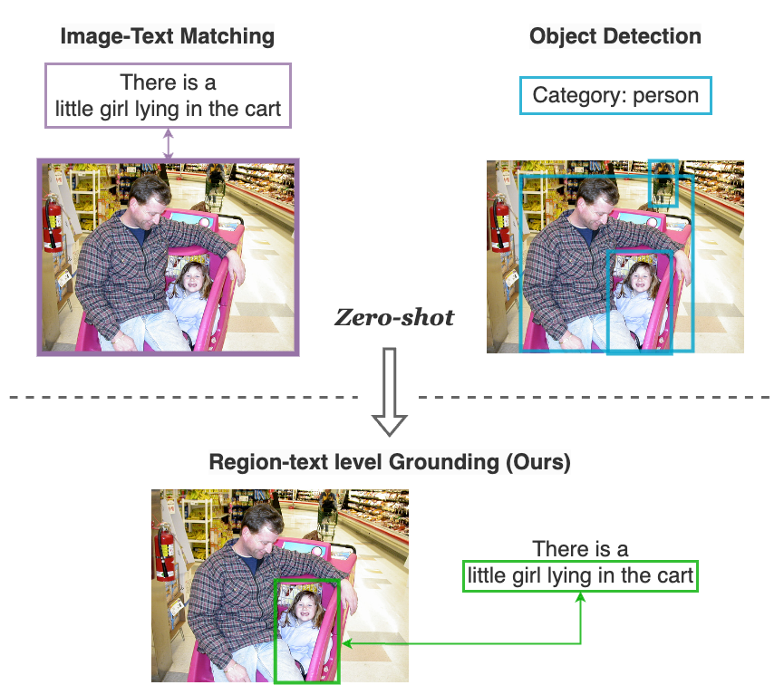
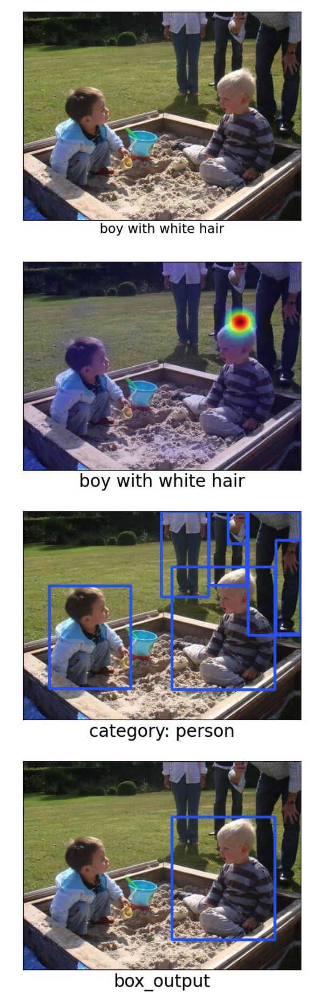

# GroundVLP
**GroundVLP**: A simple yet effective zero-shot method that harnesses visual grounding ability from the existing models trained from image-text pairs and pure object detection data
<p align="center">  </p>

> [**GroundVLP: Harnessing Zero-shot Visual Grounding from Vision-Language Pre-training and Open-Vocabulary Object Detection**](https://arxiv.org/abs/2312.15043)               
> Haozhan Shen, Tiancheng Zhao, Mingwei Zhu, Jianwei Yin              
> *AAAI 2024 ([arXiv 2312.15043](https://arxiv.org/abs/2312.15043))*  

## Installation

* First, you should install PyTorch ≥ 1.8. Please install them together at [pytorch.org](https://pytorch.org), please check PyTorch version matches that is required by Detectron2.
* For using Detic, you should install Detectron2. You could follow [Detectron2 installation instructions](https://detectron2.readthedocs.io/tutorials/install.html) to install this.
* Install requirements:
```bash
pip install -r requirements.txt
```

An example code for setting up the environment:
```bash
# create a new environment
conda create --name groundvlp python=3.8
conda activate groundvlp

git clone https://github.com/om-ai-lab/GroundVLP.git
cd GroundVLP

# install pytorch
pip install torch==1.9.1+cu111 torchvision==0.10.1+cu111 torchaudio==0.9.1 -f https://download.pytorch.org/whl/torch_stable.html

# install detectron2
python -m pip install detectron2 -f \
  https://dl.fbaipublicfiles.com/detectron2/wheels/cu111/torch1.9/index.html

# install requirements
pip install -r requirements.txt
```

## Download
### Checkpoints
Download the following checkpoints and place them at the path `checkpoints/` :
* [ALBEF](https://storage.googleapis.com/sfr-pcl-data-research/ALBEF/ALBEF.pth)
* [TCL](https://drive.google.com/file/d/1Cb1azBdcdbm0pRMFs-tupKxILTCXlB4O/view)
* [Detic](https://dl.fbaipublicfiles.com/detic/Detic_LCOCOI21k_CLIP_SwinB_896b32_4x_ft4x_max-size.pth)
### Json files
Download the following link and unzip them at the path `data/` :
* [RefCOCO/+/g INFO Json files](https://drive.google.com/file/d/1IPACy7Tb1XAK_uWGSXGDZrY-4txCOhSG/view?usp=sharing)
### Images
Download the COCO images and unzip them at the path `images/train2014` :
* [COCO_train2014](http://images.cocodataset.org/zips/train2014.zip)


Finally, the folder tree is that:
```
GroundVLP
  ├── checkpoints                                  
  │   └── ALBEF.pth
  │   └── Detic_LCOCOI21k_CLIP_SwinB_896b32_4x_ft4x_max-size.pth
  ├── data
  │   └── refcoco_val_info.json
  │   └── ...
  │   └── refcocog_val_info.json
  │── images
  │   └── train2014
  │       └── COCO_train2014_xxx.jpg
 ...
```

## Run

### Results of RefCOCO/+/g
Run this command to evaluate GroundVLP on REC datasets using the ground-truth category:
```bash
python eval_rec.py \
  --image_folder="./images/train2014" \
  --eval_data="refcoco_val,refcoco_testA,refcoco_testB,refcoco+_val,refcoco+_testA,refcoco+_testB,refcocog_val,refcocog_test" \
  --model_id="ALBEF" \
  --use_gt_category
```
Currently, the code we release only supports the ALBEF and TCL models. We will continue to update the code to support more models.

If you want to get the results using the predicted category, you should get the agent of each query first and map it into the coco label:
```
python utils/map_to_coco_label.py
```
Then run thie command:
```bash
python eval_rec.py \
  --image_folder="./images/train2014" \
  --eval_data="refcoco_val,refcoco_testA,refcoco_testB,refcoco+_val,refcoco+_testA,refcoco+_testB,refcocog_val,refcocog_test" \
  --model_id="ALBEF" \
```

### Demo
Run this command to evaluate GroundVLP on a single image-query pair:
```bash
python demo.py \
  --image_path="./docs/demo.jpg" \
  --query="boy with white hair" \
```
If setup correctly, the output image in the path `output/demo.jpg` should look like:
<p align="center">  </p>


## Citations
If you find this project useful for your research, please use the following BibTeX entry.
```
@article{shen2023groundvlp,
  title={GroundVLP: Harnessing Zero-shot Visual Grounding from Vision-Language Pre-training and Open-Vocabulary Object Detection},
  author={Shen, Haozhan and Zhao, Tiancheng and Zhu, Mingwei and Yin, Jianwei},
  journal={arXiv preprint arXiv:2312.15043},
  year={2023}
}
```

